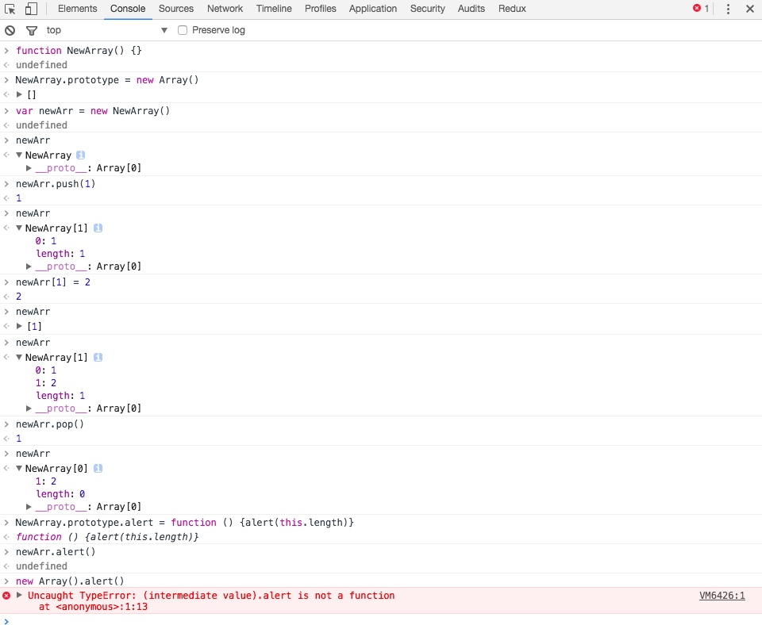

最近看了一篇关于[JS编程风格](http://web.jobbole.com/90093/)的文章，里面讲到避免使用全局函数时，举了一个关于扩展Array的例子:

反例：
```
Array.prototype.diff = function(comparisonArray) {
  var values = [];
  var hash = {};

  for (var i of comparisonArray) {
    hash[i] = true;
  }

  for (var i of this) {
    if (!hash[i]) {
      values.push(i);
    }
  }

  return values;
}
```

正例：
```
class SuperArray extends Array {
  constructor(...args) {
    super(...args);
  }

  diff(comparisonArray) {
    var values = [];
    var hash = {};

    for (var i of comparisonArray) {
      hash[i] = true;
    }

    for (var i of this) {
      if (!hash[i]) {
        values.push(i);
      }
    }

    return values;
  }
}
```
其中用到了ES6中的Class来继承Array

### 思考
如果不用ES5该怎么实现对Array的继承呢呢，我进行了下面的尝试



从上图中可以得出以下结论：
1. 使用prototype继承Array可以获得Array的方法，这些方法也可以正常调用。
2. 需要注意的是，这里用了NewArray.prototype = new Array() 而不是 NewArray.prototype = Array.prototype，两者都可以使NewArray获取到Array原型上的方法(原型链)，但是后者会使NewArray的原型指向Array的原型，当想要给NewArray的原型上添加方法时会导致Array的原型也跟着改变，而前者就不会。
3. NewArray严格上也不算是一个数组，也不算是个伪数组。它虽然拥有数组的各种方法，但是直接给它赋值时，如：newArray[1] = 2，并没有改变数组的length，虽然newArray[1]可以提取出数据，但毕竟不满足正常数组的特性。

### 总结
ES6的Class确实是扩展Array(或者其他类)最好的方式，ES5也可以用其他手段去实现，但会有一定的瑕疵，想做到完美继承会比较麻烦。对于文章中的需求，在我看来还不如使用第三方(或者自己实现)函数去实现。
